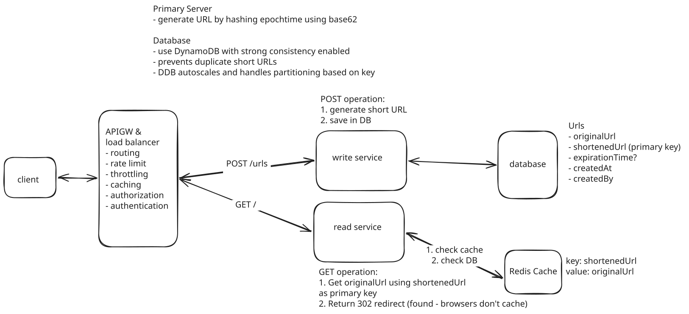

## Design Bitly

Bitly is a link management and URL shortening platform that converts long, complex web addresses into shorter, customized links.

### Functional Requirements
1. User sends a URL of any length and receives a short unique URL
2. short unique URL redirects to original URL website

BTL
- Authorization & Authentication
- Click Analytics

### Non-Functional Requirements
- Ensures uniqueness for short link
- Redirection has minimal latency < 100ms
- System is highly reliable and available (availability > consistency)
- Scalable to support 1 billion shortend links and 100M DAU

### Core Entities
- Original URL
- Shortened URL
- User

### APIs
POST /urls
{
    original_url: "https:\\www.example.com"
    custom_url_alias: "example" (optional)
    expiration_date: datetimestamp (optional)
}
->
{
    shortened_url
}

GET /{shortened_url} -> 302 redirect

## High Level Design
