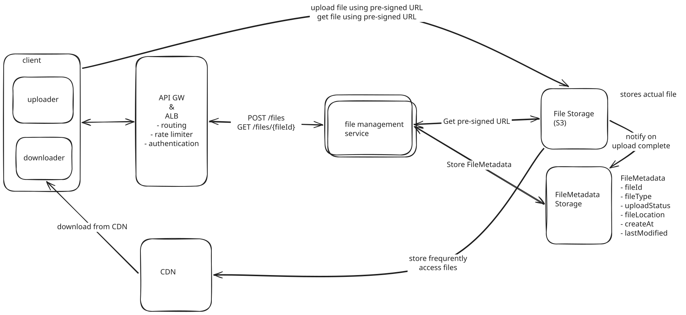

## Design Dropbox

Dropbox is a cloud-based file hosting and synchronization service. It allows users to store files online, access them from any device, and easily share them with others.

### Functional Requirements
- User is able to upload a file from any device
- User is able to download the file from any device
- User is able to share file with others and view shared files
- User can automatically sync files across devices

### Non-Functional Requirements
- System is highly available (availability > consistency)
- System supports files as large as 50GB
- System is secure, reliable
- Upload, download, sync times as fast as possible (low latency)

### Core Entities
- File
- FileMetadata
- User

### APIs
POST /files
{
    File,
    FileMetadata
} -> 2XX

GET /files/{fileId} -> File & FileMetadata

POST /files/{fileId}/share
{
    User[]
} -> 2XX

GET /files/changes?since={timestamp} -> ChangeEvent[]

ChangeEvent{
    fileId,
    changeType: CREATED, UPDATED, DELETED
}

We'll use JWT for authentication: user provides credentials -> server verifies and generates signed JWT token ->
client receives and stores signed JWT token -> subsequent requests passes JWT token

## High Level Design
